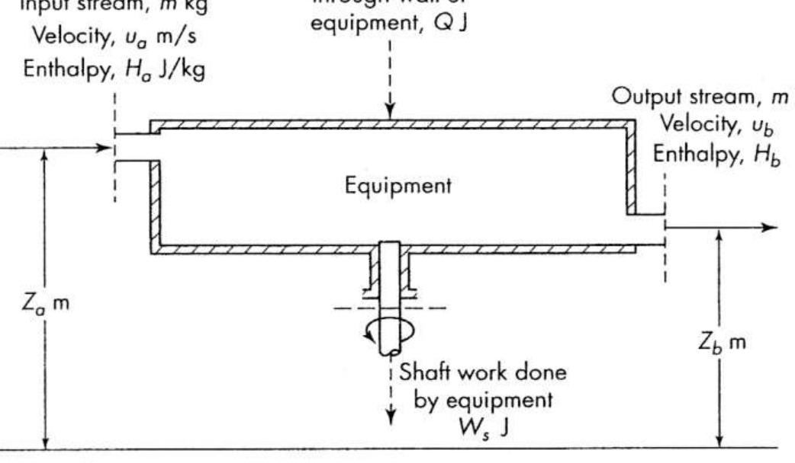

$$
\mathbf{C H A P T E R} \, \mathbf{1}
$$

踹时钲泼藕霆经懿谎颦S谌兽荦柒泫蛲诟悲崧S葴菠料

## Definitions and Principles

Chemical engineering has to do with industrial processes in which raw materials are changed or separated into useful products. The chemical engineer must develop, design, and engineer both the complete process and the equipment used; choose the proper raw materials; operate the plants efficiently, safely, and economically; and see to it that products meet the requirements set by the customers. Chemical engineering is both an art and a science. Whenever science helps the engineer to solve a problem, science should be used. When, as is usually the case, science does not give a complete answer, it is necessary to use experience and judgment. The professional stature of an engineer depends on skill in utilizing all sources of information to reach practical solutions to processing problems.

The variety of processes and industries that call for the services of chemical engineers is enormous. In the past, the areas of most concern to chemical engineers were ore beneficiation, petroleum refining, and the manufacture of heavy chemicals and organics such as sulfuric acid, methyl alcohol, and polyethylene. Today items such as polymeric lithographic supports for the electronics industry, high-strength composite materials, genetically modified biochemical agents in areas of food processing, and drug manufacture and drug delivery have become increasingly important. The processes described in standard treatises on chemical technology and the Mnantntnantnd ocrenmd

Because of the variety and complexity of modern processes, it is not practicable to cover the entire subject matter of chemical engineering under a single head. The field is divided into convenient, but arbitrary, sectors. This text covers that portion of chemical engineering known as the unit operations.

4 $S E C T 1 \, O \, \mathrm{N}$ l:Introduction

## UNIT OPERATIONS

An economical method of organizing much of the subject matter of chemical engineering is based on two facts: (1) Although the number of individual processes is great, each one can be broken down into a series of steps, called operations, each of which in turn appears in process after process; (2) the individual operations have common techniques and are based on the same scientific principles. For example, in most processes solids and fluids must be moved; heat or other forms of energy must be transferred from one substance to another, and tasks such as drying, size reduction, distillation, and evaporation must be performed. The unit operation concept is this: By studying systematically these operations themselves- -operations that clearly cross industry and process lines--the treatment of all processes is unified and simplified.
The strictly chemical aspects of processing are studied in a companion area of chemical engineering called reaction kinetics. The unit operations are largely used to conduct the primarily physical steps of preparing the reactants, separating and purifying the products, recycling unconverted reactants, and controlling the energy transfer into or out of the chemical reactor.

The unit operations are as applicable to many physical processes as to chemical ones. For example, the process used to manufacture common salt consists of the following sequence of unit operations: transportation of solids and liquids, transfer of heat, evaporation, crystallization, drying, and screening. No chemical reaction appears in these steps. On the other hand, the cracking of petroleum, with or without the aid of a catalyst, is a typical chemical reaction conducted on an enormous scale. Here the unit operations---transportation of fluids and solids, distillation, and various mechanical separations--are vital, and the cracking reaction could not be utilized without them. The chemical steps themselves are conducted by controlling the flow of material and energy to and from the reaction zone.

Because the unit operations are a branch of engineering, they are based on both science and experience. Theory and practice must combine to yield designs for equipment that can be fabricated, assembled, operated, and maintained. $\mathrm{A}$ balanced discussion of each operation requires that theory and equipment be considered together. This book presents such a balanced treatment.

## Scientific foundations of unit operations

A number of scientific principles and techniques are basic to the treatment of the unit operations. Some are elementary physical and chemical laws such as the conservation of mass and energy, physical equilibria, kinetics, and certain properties of matter. Their general use is described in the remainder of this chapter. Other special techniques important in chemical engineering are considered at the proper places in the text.

## UNIT SYSTEMS

The official international system of units is SI (Systeme International d'Unités). Strong efforts are underway for its universal adoption as the exclusive system for CHAPTER 1: Definitions and Principle

all engineering and science, but older systems, particularly the centimeter-gram-second (cgs) and foot-pound-second (fps) engineering gravitational systes, are still in use and probably will be around for some time. The chemical engineer finds many physiochemical data given in cgs units; that many calculations are most conveniently done in fps units; and that SI units are increasingly encountered in science and engineering. Thus it becomes necessary to be expert in the use of all tree systems.

In the following treatment, SI is discussed first, and then the other systems are derived from it. The procedure reverses the historical order, as the SI units evolved from the cgs system. Because of the growing importance of SI, it should logically be given a preference. $\mathrm{I f},$ in time, the other systems are phased out, they can be ignored and SI used exclusively.

## Physical Quantities

Any physical quantity consists of two parts: a unit, which tells what the quantity is and gives the standard by which it is measured, and a number, which tells how many units are needed to make up the quantity. For example, the statement that the distance between two points is 3 m means all this: A definite length has been measured; to measure it, a standard length, called the meter, has been chosen as a unit; and three l-m units, laid end to end, are needed to cover the distance. If an integral number of units are either too few or too many to cover a given distance, submultiples, which are fractions of the unit, are defined by dividing the unit into fractions, so that a measurement can be made to any degree of precision in terms of the fractional units. No physical quantity is defined until both the number and the unit are given.

## SI Units

The SI system covers the entire field of science and engineering, including electro-magnetics and illumination. For the purposes of this book, a subset of the SI units covering chemistry, gravity, mechanics, and thermodynamics is sufficient. The units are derivable from (1) four proportionalities of chemistry and physics; (2) arbitrary standards for mass, length, time, temperature, and the mole; and (3) arbitrary choices for the numerical values of two proportionality constants.

$$
\mathrm{B a s i c \ e q u a t i o n s}
$$

The basic proportionalities, each written as an equation with its own proportionality factor, are

$$
F=k_{1} \frac{d} {d t} ( m u ) \ \ \ \ \ \ \ \ \ \ \ \ \ \ \ \ \ \ \ \ \ \ \ \ \ \ \ \ \ \ \ \ \ \ \ \ \ \ \ \ \ \ \ \ \ \ \ \ \ \ \ \ \ \ \ \ \ \ \ \ \ \ \ \ \ \ \ \ \ \ \ \ \ \ \ \ \ \ \ \ \ \ \ \ \ \ \ \ \ \ \ \ \ \ \ \ \ \ \ \ \ \ \ \ \ \ \ \ \ \ \ \ \ \ \ \ \ \ \ \ \ \ \ \ \ \ \ \ \ \ \ \ \ \ \ \ \ \ \ \ \ \ \ \ \ \ \ \ \ \ \ \ \ \ \ \ \ \ \ \ \ \ \ \ \ \ \ \ \ \ \ \ \ \ \ \ \ \ \ \ \ \ \ \ \ \ \ \ \ \ \ \ \ \ \ \ \ \ \ \ \ \ \ \} \ \ \} \ \ \ \ \ \ \ \ \ \ \ \ \ \ \ \ \ \ \ \ \ \ \ \ \ \ \ \ \ \ \ \ \ \ \ \ \ \ \ \ \ \ 7 \ 7 \ 7 \ 7 \ 7 \ 7 \ 7 \ 7 \ 7 \ 7 \ 7 \ 7 \ 7 \ 7 \ 7 \ 7 7 7 7 7 7 7 7 7 7 7 7 7 7 7 7 7 7 7 7 7 7 7 7 7 7 7 7 7 7 7 7 7 7 7 7 7 7 7 7 7 7 7 7 7 7 7 7 7 7 7 7 7 7 7 7 7 7 7 7 7 7 7 7 7 7 7 7 7 7 7 7 7 7 7 7 7 7 7 7 7 7 7 7 7 7 7 7 7 7 7 7 7 7 7 7 7 7 7 7 7 7 7 7 7 7 7 7 7 7 7 7 7 7 7 7 7 7 7 7 7 7 7 7 7 7 7 7 7 7 7 7 7 7 7 7 7 7 7 7 7 7 7 7 7 7 7 7 7 7 7 7 7 7 7 7 7 7 7 7 7 7 7 7 7 7 7 7 7 7 7 7 7 7 7 7 7 7 7 7 7 7 7 7 7 7 7 7 7 7 7 7 7 7 7 7 7 7 7 7 7 7 7 7 7 7 7 7 7 7 7
$$

$$
F=k_{2} \frac{m_{a} m_{b}} {r^{2}} \qquad\qquad\qquad\qquad\qquad\qquad( 1. 2 )
$$

 $Q_{c}=k_{3} W_{c}$ (1.3)
p→u m

$$
T=k_{4} \operatorname* {l i m}_{a} {\frac{p V} {a_{a}}} \qquad\qquad\qquad\qquad\qquad( 1. 4 )
$$

$$
6 \quad\mathsf{s \, E C T l o N \, I \! :} \ \mathrm{I n t r o d u c t i o n}
$$

$$
\mathrm{w h e r e^{\dagger}} \qquad\qquad F=\mathrm{f o r c e}
$$

$$
t=\mathrm{t i m e}
$$

$$
m=\mathrm{m a s s}
$$

$$
\begin{aligned} {u=\mathrm{v e l o c i t y}} \\ {r=\mathrm{d i s t a n c e}} \\ \end{aligned}
$$

$$
W_{c}=\mathrm{w o r k}
$$

$$
{\cal Q}_{c}=\mathrm{h e a t}
$$

$$
p={\mathrm{p r e s s u r e}}
$$

$$
V=\mathrm{v o l u m e}
$$

 $T$ = thermodynamic absolute temperature

$$
k_{1}, \, k_{2}, \, k_{3}, \, k_{4}=\mathrm{p r o p o r t i o n a l i t y ~ f a c t o r s}
$$

Equation (1.1) is Newton's second law of motion, showing the proportionality between the resultant of all the forces acting on a particle of mass $m$ and the time rate of increase in momentum of the particle in the direction of the resultant force. Equation (1.2) is Newton's law of gravitation, giving the force of attraction between two particles of masses $m_{a}$ and $m_{b}$ a distance $r$ apart.

Equation (1.3) is one statement of the first law of thermodynamics. It affirms the proportionality between the work performed by a closed system during a cycle and the heat absorbed by that system during the same cycle.

Equation (1.4) shows the proportionality between the thermodynamic absolute temperature and the zero-pressure limit of the pressure-volume product of a definite mass of any gas.

Each equation states that if means are available for measuring the values of all variables in that equation and if the numerical value of $k$ is calculated, then the value of $k$ is constant and depends only on the units used for measuring the variables in the equation.

$$
\mathrm{S t a n d a r d s}
$$

By international agreement, standards are fixed arbitrarily for the quantities of mass, length, time, temperature, and the mole. These are five of the base units of SI. Currently, the standards are as follows.

The standard of mass is the kilogram (kg), defined as the mass of the international kilogram, a platinum cylinder preserved at Sevres, France.

The standard of length is the meter (m), defined' (since 1983) as the length of the

path traveled by light in vacuum durin a time interval of 1/299,792,458 f a scond. The standard of time is the second (s), defined as 9,192,631.770" frequency cy clesofa ertain uantum trasitio n an atom f lSCe

The standard of temperature is the kelvin (K), defined by assigning the value 273.16* K to the temperature of pure water at its triple point, the unique temperature at which liquid water, ice, and steam can exist at equilibrium.

The mole (abbreviated mol) is defined' as the amount of a substance comprising as many elementary units as there are atoms in 12" g of $1 2 {\bf C}.$ The definition of the mole is equivalent to the statement that the mass of one mole of a pure substance CHAPTER 1: Definitions and Principles

in grams is numerically equal to its molecular weight calculated from the standard table of atomic weights, in which the atomic weight of carbon is given as 12.01115. This number differs from 12" because it applies to the natural isotopic mixture of carbon rather than to pure 2C. In engineering calculations the terms kilogram mole and pound mole are commonly used to designate the mass of a pure substance in kilograms or pounds that is equal to its molecular weight.

The actual number of molecules in one gram mole is given by Avogadro's number, $6. 0 2 2 \times1 0^{2 3}.$ 

## Evaluation of constants

上和品园dcdcedhkeceheso $u$ in meters per second. Constants $k_{1}$ and $k_{2}$ measured in kilograms, $m, \, m_{a},$ and $m_{b}$ in Eqs. (1.1) and (1.2) are
 $r$ 
are not independent but are related by eliminating $F$ from Eqs. (1.1) and (1.2). This gives

$$
\frac{k_{1}} {k_{2}}=\frac{d ( m u ) / d t} {m_{a} m_{b} / r^{2}}
$$

Either $k_{1}$ or $k_{2}$ may be fixed arbitrarily. Then the other constant must be found by experiments in which inertial forces calculated by Eq. (1.1) are compared with gravitational forces calculated by Eq. (1.2). In SI, $k_{1}$ is fixed at unity and $k_{2}$ found experimentally. Equation (1.1) then becomes

$$
F=\frac{d} {d t} ( m u ) \ \ \ \ \ \ \ \ \ \ \ \ \ \ \ \ \ \ \ \ \ \ \ \ \ \ \ \ \ \ \ \ \ \ \ \ \ \ \ ( 1. 5 )
$$

The force defined by Eq. (1.5) and also used in Eq. (1.2) is called the newton (N). From Eq. (1.5),

$$
1 \; \mathrm{N} \equiv1 \; \mathrm{k g} \cdot\mathrm{m / s}^{2} \; \; \; \; \; \; \; \; \; \; \; \; \; \; \; \; \; \; \; \; \; \; \; \; \; \; \; \; \; \; \; \; \; \; \; \; \; \; \; \; \; \; \; \; \; \; \; \; \; \; \; \; \; \; \; \; \; \; \; \; \; \; \; \; \; \; \; \; \; \; \; \; \; \; \; \; \; \; \; \; \; \; \; \; \; \; \; \; \; \; \; \; \; \; \; \; \; \; \; \; \; \; \; \; \; \; \; \; \; \; \; \; \; \; \; \; \; \; \; \; \; \; \; \; \; \; \; \; \; \; \; \; \; \; \; \; \; \; \; \; \; \; \; \; \; \; \; \; \; \; \; \; \; \; \; \; \; \; \; \; \; \; \; \; \; \; \; \; \; \; \; \; \; \; \; \; \; \; \; \; \; \; \; \; \; \; \; \; \; \; \; \; \; \; \; \; \; \; \; \; \; \; \; \; \; \; \; \; \; \; \; \; \; \; \; \; \; \; \; \; \; \; \; \; \; \; \; \; \; \; \; \; \; \; \; \; \; \; \; \; \; \; \; \; \; \; \; \; \; \; \; \; \; \; \; \; \; \; \; \; \; \; \; \; \; \; \; \; \; \; \; \; \; \; \; \; \; \; \; \; \; \; \; \; \; \; \; \; \; \; \; \; \; \; \; \; \; \; \; \; \; \; \; \; \; \; \; \; \; \; \; \; \; \; \; \; \; \; \; \; \; \; \; \; \; \; \; \; \; \; \; \; \; \; \; \; \; \; \; \; \; \; \; \; \; \; \; \; \; 1 1 1 1 1 1 1 1 1 1 1 1 1 1 1 \ 1 \ 1 \ 1 \ . \ . \ . \ . \ . \ . \ . \ . \ . \ . \ . \ . \ . \ . \ 7 7 7 7 7 7 \ 7 \ 7 \ 7 \ 7 \ 7 \ 7 \ 7 \ 7 \ 7 \ 7 \ 7 \ 7 \ 7 \ 7 \ \ \ \ 7 \ \ \ \ \ \ \ \ \ \ \ \ \ \ \ \ \ \ \ \ \ \ \ \ \ \ \ \ \ \ \ \ \ \ \ \ \ \ \ \ \ \ \ \
$$

Constant $k_{2}$ is denoted $\textrm{b y} \ G$ and called the gravitational constant. Its recom mended value is

$$
G=6. 6 7 2 6 \times1 0^{-1 1} \, \mathrm{N \cdot m^{2} / k g^{2}} \qquad\qquad\qquad\qquad\quad( 1. 7 )
$$

## Work, energy, and power

In SI, both work and energy are measured in newton-meters, a unit called the joule (J), and so

$$
1 \; \mathrm{I} \; \mathrm{J} \equiv1 \; \mathrm{N} \cdot\mathrm{m}=1 \; \mathrm{k} \mathrm{g} \cdot\mathrm{m}^{2} / \mathrm{s}^{2} \qquad\qquad\qquad\qquad\qquad( 1. 8 )
$$

Power is measured in joules per second, a unit called the $w a t t \ ( \mathrm{W} )$ 

$$
\mathbf{H e a t}
$$

The constant $k_{3}$ in Eq. (1.3) may be fixed arbitrarily. In SI $\mathrm{i t},$ like $k_{1}$ , is set at unity. Equation (1.3) becomes

$$
Q_{c}=W_{c} \qquad\qquad\qquad\qquad\qquad\qquad\qquad( 1. 9 )
$$

Heat, like work, is measured in joules

$$
8 \quad\mathsf{s \, E C T l o N \, I \! :} \ \mathrm{I n t r o d u c t i o n}
$$

## Temperature

The quantity $p$ V/m in Eq. (1.4) may be measured $\mathrm{i n ~ ( N / m^2 ) ( m^3 / k g ) ~}.$ , or J/kg. With an arbitrarily chosen gas, this quantity can be determined by measuring $p$ and $V$ of $m$ kg of gas while it is immersed in a thermostat. In this experiment, only constancy of temperature, not magnitude, is needed. Values of $p V / m$ at various pressures and at constant temperature can then be extrapolated to zero pressure to obtain the limiting value required in Eq. (1.4) at the temperature of the thermostat. For the special situation in which the thermostat contains water at its triple point, the limiting value is designated by $( p V / m )_{0}.$ , For this experiment Eq. (1.4) gives

$$
2 7 3. 1 6=k_{4} \operatorname* {l i m}_{p \to0} \left( {\frac{p V} {m}} \right)_{0} \qquad\qquad\qquad\qquad( 1. 1 0 )
$$

For an experiment at temperature $T$ K, Eq. (1.4) can be used to eliminate $k_{4}$ from Eq. (1.10), giving

$$
T \equiv2 7 3. 1 6 {\frac{{\operatorname* {l i m}_{p \to0}} ( p V / m )_{T}} {{\operatorname* {l i m}_{p \to0}} ( p V / m )_{0}}} \qquad\qquad\qquad\qquad( 1. 1 1 )
$$

Equation (1.11) is the definition of the Kelvin temperature scale from the experimental pressure-volume properties of a real gas.

## Celsius temperature

In practice, temperatures are expressed on the Celsius scale, in which the zero point is set at the ice point, defined as the equilibrium temperature of ice and air-saturated water at a pressure of one atmosphere. Experimentally, the ice point is found to be 0.01K below the triple point of water, and so it is at 273.15 $\mathrm{K}$ . The Celsius temperature (°C) is defined by

$$
T^{\circ} \mathrm{C} \equiv T \mathrm{~ K}-2 7 3. 1 5 \qquad\qquad\qquad\qquad\qquad( 1. 1 2 )
$$

On the Celsius scale, the experimentally measured temperature of the steam point, which is the boiling point of water at a pressure of 1 atm, is 100.00C.

## Decimal units

In SI, a single unit is defined for each quantity, but named decimal multiples and submultiples also are recognized. They are listed in Table 1.1. Time may be expressed in the nondecimal units: minutes (min), hours (h), or days (d).

## Standard gravity

For certain purposes, the acceleration of free fall in the earth's gravitational field is used. From deductions based on Eq. (1.2), this quantity, denoted by $g$ ,is nearly constant. It varies slightly with latitude and height above sea level. For precise calculations, an arbitrary standard $g_{n}$ has been set, defined by

$$
g_{n} \equiv9. 8 0 6 6 5^{*} \; {\mathrm{m / s^{2}}} \qquad\qquad\qquad\qquad\qquad\qquad( 1. 1 3 )
$$

CHAPTER 1: Definitions and Principles

TABLE 1.1

SI and cgs prefixes for multiples and submultiples

| Factor | Prefix | Abbreviation | Factor | Prefix | Abbreviation |
| --- | --- | --- | --- | --- | --- |
| 10'2 | tera | T | 10-1 | deci | d |
| 10° | giga | G | 10-2 | centi | c |
| 2 106 | mega | M | 10-3 | milli | m |
| 10} | kilo | k | 10-6 | micro | u |
| 10- | hecto | h | 10-9 | nano | n |
| 10' | deka | da | 10-12 | pico | p |
| . |  | 10-15 | 一 femto | f |
| 7 |  | 10-18 | atto | a |

## Pressure units

The natural unit of pressure in SI is the newton per square meter. This unit, called the pascal (Pa), is inconveniently small, and a multiple, called the bar, also is used. It is defined by

$$
\mathrm{1 \: b a r \equiv1 \times1 0^{5} \: P a=1 \times1 0^{5} \: N / m^{2} ~ ~ ~ ~ ~ ~ ~ ~ ~ ~ ~ ~ ~ ~ ~ ~ ~ ~ ~ ~ ~ ~ ~ ~ ~ ~ ( 1. 1 4 ) ~}
$$

A more common empirical unit for pressure, used with all systems of units, is the standard atmosphere (atm), defined by

$$
1 \; {\mathrm{a t m}} \equiv1. 0 1 3 2 5^{*} \times1 0^{5} \; {\mathrm{P a}}=1. 0 1 3 2 5 \; {\mathrm{b a r s}} \; \; \; \; \; \; \; \; \; \; \; \; \; \; \; \; \; \; \; \; ( 1. 1 5 )
$$

## CGS Units

The older cgs system can be derived from SI by making certain arbitrary decisions. The standard for mass is the gram (g), defined by

$$
{\sf I} {\sf g} \equiv{\sf1} \times1 0^{-3} {\sf k g} \qquad\qquad\qquad\qquad\qquad( 1. 1 6 )
$$

The standard for length is the centimeter (cm), defined by

$$
1 \; {\mathrm{c m}} \equiv1 \times1 0^{-2} \; {\mathrm{m}} \qquad\qquad\qquad\qquad\qquad( 1. 1 7 )
$$

Standards for time, temperature, and the mole are unchanged.

As in SI, constant $k_{1}$ in Eq. (1.1) is fixed at unity. The unit of force is called the dyne (dyn), defined by

$$
1 ~ \mathrm{d y n} \equiv1 ~ \mathrm{g} \cdot\mathrm{c m / s}^{2} ~ ~ ~ ~ ~ ~ ~ ~ ~ ~ ~ ~ ~ ~ ~ ~ ~ ~ ~ ~ ~ ~ ~ ~ ~ ~ ~ ~ ~ ~ ~ ~ ~ ~ ~ ~ ~ ~ ~ ~ ~ ~ ~ ~ ~ ~ ~ ~ ~ ~ ~ ~ ~ ~ ~ ~ ~ ~ ~ ~ ~ ~ ~ ~ ~ ~ ~ ~ ~ ~ ~ ~ ~ ~ ~ ~ ~ ~ ~ ~ ~ ~ ~ ~ ~ ~ ~ ~ ~ ~ ~ ~ ~ ~ ~ ~ ~ ~ ~ ~ ~ ~ ~ ~ ~ ~ ~ ~ ~ ~ ~ ~ ~ ~ ~ ~ ~ ~ ~ ~ ~ ~ ~ ~ ~ ~ ~ ~ ~ ~ ~ ~ ~ ~ ~ ~ ~ ~ ~ ~ ~ ~ ~ ~ ~ ~ ~ ~ ~ ~ ~ ~ ~ ~ ~ ~ ~ ~ ~ ~ ~ ~ ~ ~ ~ ~ ~ ~ ~ ~ ~ ~ ~ ~ ~ ~ ~ ~ ~ ~ ~ ~ ~ ~ ~ ~ ~ ~ ~ ~ ~ ~ ~ ~ ~ ~ ~ ~ ~ ~ ~ ~ ~ ~ ~ ~ ~ ~ ~ ~ ~ ~ ~ ~ ~ ~ ~ ~ ~ ~ ~ ~ ~ ~ ~ ~ ~ ~ ~ ~ ~ ~ ~ ~ ~ ~ ~ ~ ~ ~ ~ ~ ~ ~ ~ ~ ~ ~ ~ ~ ~ ~ ~ ~ ~ ~ ~ ~ ~ ~ ~ ~ ~ ~ ~ ~ ~ ~ ~ ~ ~ ~ ~ ~ ~ ~ ~ ~ ~ ~ ~ ~ ~ ~ ~ ~ ~ ~ ~ ~ ~ ~ ~ ~ ~ ~ ~ ~ ~ ~ ~ ~ ~ ~ ~ ~ ~ ~ ~ ~ ~ ~ ~ ~ ~ ~ ~ ~ ~ ~ ~ ~ ~ ~ ~ ~ ~ ~ ~ ~ ~ ~ ~ ~ ~ ~ ~ ~ ~ ~ ~ ~ ~ ~ ~ ~ ~ ~ ~ ~ ~ ~ ~ ~ ~ ~ ~ ~ ~ ~ ~
$$

The unit for energy and work is the $e r g,$ defined by

$$
\mathrm{1 \ e r g \equiv1 \ d y n \cdot c m=1 \times1 0^{-7} \ J ~} \qquad\qquad\qquad( 1. 1 9 )
$$

Constant $k_{3}$ in Eg. (1.3) is not unity. A unit for heat, called the calorie (cal), is used to convert the unit for heat to ergs. Constant $1 / k_{3}$ is replaced by $J,$ which $S E \subset\mathsf{T I O N} \; \; 1 :$ Introduction

denotes the quantity called the mechanical equivalent of heat and is measured in joules per calorie. Equation (1.3) becomes

$$
W_{c}=J Q_{c} ~ ~ ~ ~ ~ ~ ~ ~ ~ ~ ~ ~ ~ ~ ~ ~ ~ ~ ~ ~ ~ ~ ~ ~ ~ ~ ~ ~ ~ ~ ~ ~ ~ ~ ~ ~ ~ ~ ~ ~ ~ ~ ~ ~ ~ ~ ~ ~ ~ ~ ~ ~ ~ ~ ~ ~ ~ ~ ~ ~ ~ ~ ~ ~ ~ ~ ~ ~ ~ ~ ~ ~ ~ ~ ~ ~ ~ ~ ~ ~ ~ ~ ~ ~ ~ ~ ~ ~ ~ ~ ~ ~ ~ ~ ~ ~ ~ ~ ~ ~ ~ ~ ~ ~ ~ ~ ~ ~ ~ ~ ~ ~ ~ ~ ~ ~ ~ ~ ~ ~ ~ ~ ~ ~ ~ ~ ~ ~ ~ ~ ~ ~ ~ ~ ~ ~ ~ ~ ~ ~ ~ ~ ~ ~ ~ ~ ~ ~ ~ ~ ~ ~ ~ ~ ~ ~ ~ ~ ~ ~ ~ ~ ~ ~ ~ ~ ~ ~ ~ ~ ~ ~ ~ ~ ~ ~ ~ ~ ~ ~ ~ ~ ~ ~ ~ ~ ~ ~ ~ ~ ~ ~ ~ ~ ~ ~ ~ ~ ~ ~ ~ ~ ~ ~ ~ ~ ~ ~ ~ ~ ~ ~ ~ ~ ~ ~ ~ ~ ~ ~ ~ ~ ~ ~ ~ ~ ~ ~ ~ ~ ~ ~ ~ ~ ~ ~ ~ ~ ~ ~ ~ ~ ~ ~ ~ ~ ~ ~ ~ ~ ~ ~ ~ ~ ~ ~ ~ ~ ~ ~ ~ ~ ~ ~ ~ ~ ~ ~ ~ ~ ~ ~ ~ ~ ~ ~ ~ ~ ~ ~ ~ ~ ~ ~ ~ ~ ~ ~ ~ ~ ~ ~ ~ ~ ~ ~ ~ ~ ~ ~ ~ ~ ~ ~ ~ ~ ~ ~ ~ ~ ~ ~ ~ ~ ~ ~ ~ ~ ~ ~ ~ ~ ~ ~ ~ ~ ~ ~ ~ ~ ~ ~ ~ ~ ~ ~ ~ ~ ~ ~ ~ ~ ~ ~ ~ ~ ~ ~ ~ ~ ~ ~ ~ ~ ~ ~ ~ ~ ~ ~ ~ ~ ~ ~ ~ ~ ~ ~ ~ ~ ~ ~ ~ ~ ~ ~ ~ ~ ~ ~ ~ ~ ~ ~ ~ ~ ~ ~ ~ ~ ~ ~ ~ ~ ~ ~ ~ ~ ~ ~ 3 ~ 2 2 2 2 2 2 2 2 2 2 2 2 2 2 2 2 2 2 2 2 2 2 2 2 2 2 2 2 2 2 2 2 2 2 2 2 2 2 2 2 2 2 2 2 2 2 2 2 2 2 2 2 2 2 2 2 2 2 2 2 2 2 2 2 2 2 2 2 2 2 2 2 2 2 2 2 2 2 2 2 2 2 2 2 2 2 2 2 2 2 2 2 2 2 2 2 2 2
$$

Two calories are defined $.^{7}$ The thermochemical calorie (cal), used in chemistry, chemical engineering thermodynamics, and reaction kinetics, is defined by

$$
\mathrm{1 \ c a l} \equiv4. 1 8 4 0^{*} \times1 0^{7} \ \mathrm{e r g s}=4. 1 8 4 0^{*} \ \mathrm{J \ \ \ \ \ \ \ \ \ \ \ \ \ \ \ \ ( 1. 2 1 )}
$$

The international steam table calorie $( \mathrm{c a l}_{\mathrm{I T}} )$ , used in heat power engineering, is defined by

$$
\mathrm{1 \ c a l}_{\mathrm{I T}} \equiv4. 1 8 6 8^{*} \times1 0^{7} \mathrm{\ c r g s}=4. 1 8 6 8^{*} \mathrm{\tiny~ J ~} \qquad\qquad( 1. 2 2 )
$$

The calorie is so defined that the specific heat of water is approximately 1 cal/g . $^\circ C$ The standard acceleration of free fall in cgs units is

$$
g_{n} \equiv9 8 0. 6 6 5 \; \mathrm{c m / s^{2}} \qquad\qquad\qquad\qquad\qquad( 1. 2 3 )
$$

## FPS Engineering Units

In some countries a nondecimal gravitational unit system has long been used in commerce and engineering. The system can be derived from SI by making the following decisions.

The standard for mass is the avoirdupois pound (1b), defined by

$$
1 \; \mathrm{l b}=0. 4 5 3 5 9 2 3 7^{*} \; \mathrm{k g} \qquad\qquad\qquad\qquad\qquad( 1. 2 4 )
$$

The standard for length is the inch (in.), defined as 2.54* cm. This is equivalent to defining the foot (ft) as

$$
1 \; \mathrm{f t} \equiv2. 5 4 \times1 2 \times1 0^{-2} \; \mathrm{m}=0. 3 0 4 8^{*} \; \mathrm{m} \qquad\qquad\qquad( 1. 2 5 )
$$

The standard for time remains the second (s).

The thermodynamic temperature scale is called the Rankine scale, in which temperatures are denoted by degrees Rankine and defined by

$$
1^{\circ} \mathrm{R} \equiv\frac{1} {1. 8} \: \mathrm{K} \qquad\qquad\qquad\qquad\qquad( 1. 2 6 )
$$

The ice point on the Rankine scale is $2 7 3. 1 5 \times1. 8=4 9 1. 6 7^{\circ} \mathrm{R}.$ 

The analog of the Celsius scale is the Fahrenheit scale, in which readings are denoted by degrees Fahrenheit. It is derived from the Rankine scale by setting its zero point exactly 32*F below the ice point on the Rankine scale, so that

$$
T^{\circ} {\mathrm{F}} \equiv T^{\circ} {\mathrm{R}}-( 4 9 1. 6 7-3 2 )=T^{\circ} {\mathrm{R}}-4 5 9. 6 7 \qquad\qquad( 1. 2 7 )
$$

The relation between the Celsius and Fahrenheit scales is given by the exact equation
$$
T^{\circ} \mathrm{F}=3 2+1. 8^{\circ} \mathrm{C} \tag{1.28}
$$

$$
T^{\circ} \mathrm{F}=3 2+1. 8^{\circ} \mathrm{C} \qquad\qquad\qquad\qquad\qquad( 1. 2 8 )
$$

CHAPTER 1: Definitions and Principles

From this equation, temperature differences are related by

$$
\Delta T^{\circ} \mathbb{C}=1. 8 \ \Delta T^{\circ} \mathrm{F}=\Delta T \mathrm{~ K ~} \qquad\qquad\qquad\qquad( 1. 2 9 )
$$

$$
\mathrm{T h e ~ s t e a m ~ p o i n t ~ i s ~ 2 1 2. 0 0^{\circ} F.}
$$

## Pound force

The fps system is characterized by $^\mathrm{a}$ gravitational unit of force, called the pound force $( \mathbf{l b}_{f} )$ . The unit is so defined that a standard gravitational field exerts a force of one pound on a mass of one avoirdupois pound. The standard acceleration of free fall in fps units is, to five significant figures,

$$
g_{n}={\frac{9. 8 0 6 6 5 {\mathrm{~ m / s^{2}}}} {0. 3 0 4 8 {\mathrm{~ m / f t}}}}=3 2. 1 7 4 {\mathrm{~ f t / s^{2} ~}} \qquad\qquad\qquad( 1. 3 0 )
$$

The pound force is defined by

$$
1 \; \mathrm{l b}_{f} \equiv3 2. 1 7 4 \; \mathrm{l b} \cdot\mathrm{f t} / \mathrm{s}^{2} ~ ~ ~ ~ ~ ~ ~ ~ ~ ~ ~ ~ ~ ~ ~ ~ ~ ~ ~ ~ ~ ~ ~ ~ ~ ~ ~ ~ ~ ~ ~ ~ ~ ~ ~ ~ ~ ~ ~ ~ ~ ~ ~ ~ ~ ~ ~ ~ ~ ~ ~ ~ ~ ~ ~ ~ ~ ~ ~ ~ ~ ~ ~ ~ ~ ~ ~ ~ ~ ~ ~ ~ ~ ~ ~ ~ ~ ~ ~ ~ ~ ~ ~ ~ ~ ~ ~ ~ ~ ~ ~ ~ ~ ~ ~ ~ ~ ~ ~ ~ ~ ~ ~ ~ ~ ~ ~ ~ ~ ~ ~ ~ ~ ~ ~ ~ ~ ~ ~ ~ ~ ~ ~ ~ ~ ~ ~ ~ ~ ~ ~ ~ ~ ~ ~ ~ ~ ~ ~ ~ ~ ~ ~ ~ ~ ~ ~ ~ ~ ~ ~ ~ ~ ~ ~ ~ ~ ~ ~ ~ ~ ~ ~ ~ ~ ~ ~ ~ ~ ~ ~ ~ ~ ~ ~ ~ ~ ~ ~ ~ ~ ~ ~ ~ ~ ~ ~ ~ ~ ~ ~ ~ ~ ~ ~ ~ ~ ~ ~ ~ ~ ~ ~ ~ ~ ~ ~ ~ ~ ~ ~ ~ ~ ~ ~ ~ ~ ~ ~ ~ ~ ~ ~ ~ ~ ~ ~ ~ ~ ~ ~ ~ ~ ~ ~ ~ ~ ~ ~ ~ ~ ~ ~ ~ ~ ~ ~ ~ ~ ~ ~ ~ ~ ~ ~ ~ ~ ~ ~ ~ ~ ~ ~ ~ ~ ~ ~ ~ ~ ~ ~ ~ ~ ~ ~ ~ ~ ~ ~ ~ ~ ~ ~ ~ ~ ~ ~ ~ ~ ~ ~ ~ ~ ~ ~ ~ ~ ~ ~ ~ ~ ~ ~ ~ ~ ~ ~ ~ ~ ~ ~ ~ ~ ~ ~ ~ ~ ~ ~ ~ ~ ~ ~ ~ ~ ~ ~ ~ ~ ~ ~ ~ ~ ~ ~ ~ ~ ~ ~ ~ ~ ~ ~ ~ ~ ~ ~ ~ ~ ~ ~ ~ ~ ~ ~ ~ ~ ~ ~ ~ ~ ~ ~ ~ ~ ~ ~ ~ ~ ~ ~ ~ ~ ~ ~ ~ ~ ~ ~ ~ ~ ~ ~ ~ ~ ~ ~ ~ ~ ~ ~ ~ ~ ~ ~ ~ ~ ~ ~ ~ ~ ~ ~ ~ ~ ~ ~ ~ ~ ~ ~ ~ ~ ~ ~ ~ ~ ~ ~ ~ ~ ~ ~ ~ ~ ~ ~ ~ ~ ~ ~ ~ ~ ~ ~ ~ ~ ~ ~ ~ ~ ~ ~ ~ ~ ~ ~ ~ ~ ~ ~ ~ ~ ~ ~ ~ ~ ~ ~ ~ ~ ~ ~ ~ ~ ~ ~
$$

$$
\mathrm{T h e n ~ E q. ~ ( 1. 1 ) ~ g i v e s}
$$

F l, 1.32)

$$
\mathbf{\lambda} \equiv\frac{d ( m u ) / d t} {3 2. 1 7 4} \qquad\mathrm{l b \cdot f t / s^{2} ~ ~ ~ ~ ~ ~ ~ ~ ~ ~ ~ ~ ~ ~ ~ ~ ~ ~ ~ ~ ~ ~ ~ ~ ~ ~ ~ ~ ~ ~ ~ ~ ~ ~ ~ ~ ~ ~ ~ ~ ~ ~ ~ ~ ~ ~ ~ ~ ~ ~ ~ ~ ~ ~ ~ ~ ~ ~ ~ ~ ~ ~ ~ ~ ~ ~ ~ ~ ~ ~ ~ ~ ~ ~ ~ ~ ~ ~ ~ ~ ~ ~ ~ ~ ~ ~ ~ ~ ~ ~ ~ ~ ~ ~ ~ ~ ~ ~ ~ ~ ~ ~ ~ ~ ~ ~ ~ ~ ~ ~ ~ ~ ~ ~ ~ ~ ~ ~ ~ ~ ~ ~ ~ ~ ~ ~ ~ ~ ~ ~ ~ ~ ~ ~ ~ ~ ~ ~ ~ ~ ~ ~ ~ ~ ~ ~ ~ ~ ~ ~ ~ ~ ~ ~ ~ ~ ~ ~ ~ ~ ~ ~ ~ ~ ~ ~ ~ ~ ~ ~ ~ ~ ~ ~ ~ ~ ~ ~ ~ ~ ~ ~ ~ ~ ~ ~ ~ ~ ~ ~ ~ ~ ~ ~ ~ ~ ~ ~ ~ ~ ~ ~ ~ ~ ~ ~ ~ ~ ~ ~ ~ ~ ~ ~ ~ ~ ~ ~ ~ ~ ~ ~ ~ ~ ~ ~ ~ ~ ~ ~ ~ ~ ~ ~ ~ ~ ~ ~ ~ ~ ~ ~ ~ ~ ~ ~ ~ ~ ~ ~ ~ ~ ~ ~ ~ ~ ~ ~ ~ ~ ~ ~ ~ ~ ~ ~ ~ ~ ~ ~ ~ ~ ~ ~ ~ ~ ~ ~ ~ ~ ~ ~ ~ ~ ~ ~ ~ ~ ~ ~ ~ ~ ~ ~ ~ ~ ~ ~ ~ ~ ~ ~ ~ ~ ~ ~ ~ ~ ~ ~ ~ ~ ~ ~ ~ ~ ~ ~ ~ ~ ~ ~ ~ ~ ~ ~ ~ ~ ~ ~ ~ ~ ~ ~ ~ ~ ~ ~ ~ ~ ~ ~ ~ ~ ~ ~ ~ ~ ~ ~ ~ ~ ~ ~ ~ ~ ~ ~ ~ ~ ~ ~ ~ ~ ~ ~ ~ ~ ~ ~ ~ ~ ~ ~ ~ ~ ~ ~ ~ ~ ~ ~ ~ ~ ~ ~ ~ ~ ~ ~ ~ ~ ~ ~ ~ ~ ~ ~ ~ ~ ~ ~ ~ ~ ~ ~ ~ ~ ~ ~ ~ ~ ~ ~ ~ ~ ~ ~ ~ ~ ~ ~ ~ ~ ~ ~ ~ ~ ~ ~ ~ ~ ~ ~ ~ ~ ~ ~ ~ ~ ~ ~ ~ ~ ~ ~ ~ ~ ~ ~ ~ ~ ~ ~ ~ ~ ~ ~ ~ ~ ~ ~ ~ ~ \ \ \
$$

Equation (1.1) can also be written with $1 / g_{c}$ in place of $k_{1}$ :

$$
F={\frac{d ( m u ) / d t} {g_{c}}} \eq\eqno( 1. 3 3 )
$$

Comparison of Eas. (1.32) and (1.33) shows that to preserve both numerical equality and consistency of units in these equations, it is necessary to define $g_{c},$ called Newton's law proportionaliy factor for the gravitational force unit, by

$$
g_{c} \equiv3 2. 1 7 4 \; \mathrm{l b} \cdot\mathrm{f t} / \mathrm{s}^{2} \cdot\mathrm{l b}_{f} \qquad\qquad\qquad\qquad\quad( 1. 3 4 )
$$

The unit for work and mechanical energy in the fps system is the foot-pound force (ft . lb). Power is measured by an empirical unit, the horsepower (hp), defined by

$$
1 ~ \mathrm{h p} \equiv5 5 0 ~ \mathrm{f t} \cdot\mathrm{l b}_{f} / \mathrm{s} ~ ~ ~ ~ ~ ~ ~ ~ ~ ~ ~ ~ ~ ~ ~ ~ ~ ~ ~ ~ ~ ~ ~ ~ ~ ~ ~ ~ ~ ~ ~ ~ ~ ~ ~ ~ ~ ~ ~ ~ ~ ~ ~ ~ ~ ~ ~ ~ ~ ~ ~ ~ ~ ~ ~ ~ ~ ~ ~ ~ ~ ~ ~ ~ ~ ~ ~ ~ ~ ~ ~ ~ ~ ~ ~ ~ ~ ~ ~ ~ ~ ~ ~ ~ ~ ~ ~ ~ ~ ~ ~ ~ ~ ~ ~ ~ ~ ~ ~ ~ ~ ~ ~ ~ ~ ~ ~ ~ ~ ~ ~ ~ ~ ~ ~ ~ ~ ~ ~ ~ ~ ~ ~ ~ ~ ~ ~ ~ ~ ~ ~ ~ ~ ~ ~ ~ ~ ~ ~ ~ ~ ~ ~ ~ ~ ~ ~ ~ ~ ~ ~ ~ ~ ~ ~ ~ ~ ~ ~ ~ ~ ~ ~ ~ ~ ~ ~ ~ ~ ~ ~ ~ ~ ~ ~ ~ ~ ~ ~ ~ ~ ~ ~ ~ ~ ~ ~ ~ ~ ~ ~ ~ ~ ~ ~ ~ ~ ~ ~ ~ ~ ~ ~ ~ ~ ~ ~ ~ ~ ~ ~ ~ ~ ~ ~ ~ ~ ~ ~ ~ ~ ~ ~ ~ ~ ~ ~ ~ ~ ~ ~ ~ ~ ~ ~ ~ ~ ~ ~ ~ ~ ~ ~ ~ ~ ~ ~ ~ ~ ~ ~ ~ ~ ~ ~ ~ ~ ~ ~ ~ ~ ~ ~ ~ ~ ~ ~ ~ ~ ~ ~ ~ ~ ~ ~ ~ ~ ~ ~ ~ ~ ~ ~ ~ ~ ~ ~ ~ ~ ~ ~ ~ ~ ~ ~ ~ ~ ~ ~ ~ ~ ~ ~ ~ ~ ~ ~ ~ ~ ~ ~ ~ ~ ~ ~ ~ ~ ~ ~ ~ ~ ~ ~ ~ ~ ~ ~ ~ ~ ~ ~ ~ ~ ~ ~ ~ ~ ~ ~ ~ ~ ~ ~ ~ ~ ~ ~ ~ ~ ~ ~ ~ ~ ~ ~ ~ ~ ~ ~ ~ ~ ~ ~ ~ ~ ~ ~ ~ ~ ~ ~ ~ ~ ~ ~ ~ ~ ~ ~ ~ ~ ~ ~ ~ ~ ~ ~ ~ ~ ~ ~ ~ ~ ~ ~ ~ ~ ~ ~ ~ ~ ~ ~ ~ ~ ~ ~ ~ ~ ~ ~ ~ ~ ~ ~ ~ ~ ~ ~ ~ ~ ~ ~ ~ ~ ~ ~ ~ ~ ~ ~ ~ ~ ~ ~ ~ ~ ~ ~ ~ ~ ~ ~ ~ ~ ~ ~ ~ ~ ~ ~ ~ ~ ~ ~ ~ ~ ~ 2 ~ 2 ~ 2 ~ 2 ~ 2 ~ 2 ~ 2 ~ 2 1
$$

The unit for heat is the British thermal unit (Btu), defined by the implicit relation

$$
1 \; \mathrm{B u / l b} \cdot\mathrm{^\circ F} \equiv1 \; \mathrm{c a l}_{\mathrm{I T}} / \mathrm{g} \cdot\mathrm{^\circ C} \qquad\qquad\qquad\qquad\qquad( 1. 3 6 )
$$

As in the cgs system, constant $k_{3}$ in Ea. (1.3) is replaced by $1 / J,$ where $J$ is the mechanical equivalent of heat, equal to 778.17 ft - 1b,/Btu.

The definition of the Btu requires that the numerical value of specific heat be the same in both systems, and in each case the specific heat of water is approximately 1.0.

 $S E \subset\mathsf{T I O N} \; \; 1 :$ Introduction

lABLEl.L
Values of the gas constant $R$ 

| Temperature | Mass | Energy | R |
| --- | --- | --- | --- |
| Kelvins | kg mol | J | 8.314.47 |
|  | calrn | 1.9859× 103 |
|  | cal | 1.9873×103 |
|  | m'-atm | 82.056 × 10-3 |
| g mol | cm-atm | 82.056 |
| Degrees Rankine | lb mol | Btu | 1.9858 |
|  | ft ·lb, | 1,545.3 |
|  | hp.h | 7.8045 × 10- |
|  | kWh | 5.8198 × 10- |

## Gas Constant

If mass is measured in kilograms or grams, constant $k_{4}$ in Eq. (1.4) differs from gas to gas. But when the concept of the mole as a mass unit is used, $k_{4}$ can be replaced by the universal gas constant $R,$ which, by Avogadro's law, is the same for all gases. The numerical value of $R$ depends only on the units chosen for energy, temperature, and mass. Then Eq. (1.4) is written

$$
\operatorname* {l i m}_{p \to0} {\frac{p V} {n T}}=R \qquad\qquad\qquad\qquad\qquad( 1. 3 7 )
$$

where $n$ is the number of moles. This equation applies also to mixtures of gases if $n$ is the total number of moles of all the molecular species that make up the volume $V$ The accepted experimental value of $R$ isS

$$
R=8. 3 1 4 4 7 \; {\mathrm{J / K}} \cdot{\mathrm{m o l}}=8. 3 1 4 4 7 \times1 0^{7} \; {\mathrm{e r g s}} / {\mathrm{K}} \cdot{\mathrm{m o l}} \; \; \; \; \; \; \; \; \; \; \; \; \; \; ( 1. 3 8 )
$$

Values of $R$ in other units for energy, temperature, and mass are given in Table 1.2.
Although the mole is defined as a mass in grams, the concept of the mole is easily extended to other mass units. Thus, the kilogram mole (kg mol) is the usual molecular or atomic weight in kilograms, and the pound mole (lb mol) is that in avoirdupois pounds. When the mass unit is not specified, the gram mole (g mol) is intended. Molecular weight $M$ is a pure number.

Standard molar volume. From Table $1. 2,$ the volume of 1 kg mol of gas at standard conditions (1 atm, 0°C), is 82.056 $\times1 0^{-3} \times2 7 3=2 2. 4 \; {\mathrm m}^{3}$ ,or $2 2. 4 \, ( \mathrm{L} / \mathrm{g \, m o l} ).$ In fps units, the standard volume at $1$ atm and 32°F is 359 ft/1b mol.

## Conversion of Units

Since three unit systems are in common use, it is often necessary to convert the magnitudes of quantities from one system to another. This is accomplished by using conversion factors. Only the defined conversion factors for the base units are required since conversion factors for all other units can be calculated from them. Interconversions between SI and the cgs system are simple. Both use the same CHAPTER 1: Definitions and Principles

standards for time, temperature, and the mole, and only the decimal conversions defined by Eos. (1.16) and (1.17) are needed. Both SI and the fps system also use the second as the standard for time; the three conversion factors defined for mass, length, and temperature by Eqs. (1.24), (1.25), and (1.26), respectively, are'suffi-cient for all conversions of units between these two systems.

Example l.l demonstrates how conversion factors are calculated from the exact numbers used to set up the definitions of units in SI and the fps system. In conversions involving $g_{c}$ in fps units, the use of the exact numerical ratio 9.80665/0.3048 in plac f the fps number 32.1740 is recommended to give maximum precision in the final calculation and to take advantage of possible cancellations of numbers during the calculation.

EXAMPLE 1.1. Using only exact definitions and standards, calculate factors for converting $( a )$ newtons to pounds force, (b) British thermal units to IT calories, (c) atmospheres to pounds force per square inch, and $( d )$ horsepower to kilowatts.

## Solution

(a) From Es. (1.6), 1.24), and (1.25),

$$
1 \; {\mathrm{N}}=1 \; {\mathrm{k g}} \cdot{\mathrm{m}} / {\mathrm{s}}^{2}={\frac{1 \; {\mathrm{I b}} \cdot{\mathrm{f t}} / {\mathrm{s}}^{2}} {0. 4 5 3 5 9 2 3 7 \times0. 3 0 4 8}}
$$

$$
\mathrm{F r o m ~ E q. ~} ( 1. 3 0 )
$$

$$
1 ~ \mathrm{l b} \cdot\mathrm{f t} / \mathrm{s}^{2}={\frac{0. 3 0 4 8} {9. 8 0 6 6 5}} \cdot\mathrm{l b}_{f}
$$

$$
\begin{array} {r l} {\mathrm{I ~ N}={\frac{0. 3 0 4 8} {9. 8 0 6 6 5 \times0. 4 5 3 5 9 2 3 7 \times0. 3 0 4 8}} \; \mathrm{I b}_{f}} \\ {\mathrm{}={\frac{1} {9. 8 0 6 6 5 \times0. 4 5 3 5 9 2 3 7}} \; \mathrm{I b}_{f}=0. 2 2 4 8 0 9 \; \mathrm{I b}_{f}} \end{array}
$$

$$
\mathrm{a n d \ s o}
$$

In Appendix 1 it is shown that to convert newtons to pound force, one should multiply by 0.224809. Clearly, to convert from pounds force to newtons, multiply by 1/0.224809 = 4.448221.

$$
( b ) \; {\mathrm{F r o m ~ E q.}} \; ( 1. 3 6 )
$$

$$
\mathrm{1 \ B t u=1 \ c a l_{I T} \frac{1 \ l b} {1 \ g} \frac{1^{\circ} F} {1^{\circ} C}}
$$

$$
= 1 \mathrm{~ c a l}_{\mathrm{I T}} \frac{1 \mathrm{~ l b}} {1 \mathrm{~ k g}} \frac{1 \mathrm{~ k g}} {1 \mathrm{~ g}} \frac{1 \mathrm{~^{\circ} ~ F}} {1 \mathrm{^{\circ} ~ C}}
$$

$$
\mathrm{F r o m \; E q s. \;} ( 1. 1 6 ), ( 1. 2 4 ) \mathrm{, \; a n d \;} ( 1. 2 9 )
$$

$$
1 {\mathrm{~ B t u}}=1 {\mathrm{~ c a l}}_{\mathrm{\bar{\imath} T}} {\frac{0. 4 5 3 5 9 2 3 7 \times1 0 0 0} {1. 8}}=2 5 1. 9 9 6 {\mathrm{~ c a l}}_{\mathrm{\bar{\imath} T}}
$$

(c) From Eas. (1.6), (1.14), and (1.15)

$$
1 \; \mathrm{a t m}=1. 0 1 3 2 5 \times1 0^{5} \; \mathrm{k g} \cdot\mathrm{m / s}^{2} \cdot\mathrm{m}^{2}
$$

ECTIONI: Introduction

From Eas. (1.24), (1.25), and (1.34), since 1 $\mathrm{f t}=1 2 \; \mathrm{i n}.$ ,

Anin

$$
\begin{array} {r} {1 {\mathrm{~ a m}}=1. 0 1 3 2 5 \times1 0^{5} \times{\frac{1 \, {\mathrm{I}} {\mathrm{I}} {\mathrm{I}} {\mathrm{I}} {\mathrm{I}} {\mathrm{I}} {\mathrm{I}} {\mathrm{I}} {\mathrm{I}} {\mathrm{I}} {\mathrm{I}} {\mathrm{I}} {\mathrm{I}} {\mathrm{I}} {\mathrm{I}} {\mathrm{I}} {\mathrm{I}} {\mathrm{I}} {\mathrm{I}} {\mathrm{I}} {\mathrm{I}} {\mathrm{I}} {\mathrm{I}} {\mathrm{I}} {\mathrm{I}} {\mathrm{I}} {\mathrm{I}} {\mathrm{I}} {\mathrm{I}} {\mathrm{I}} {\mathrm{I}} {\mathrm{I}} {\mathrm{I}} {\mathrm{I}} {\mathrm{I}} {\mathrm{I}} {\mathrm{I}} {\mathrm{I}} {\mathrm{I}} {\mathrm{I}} {\mathrm{I}} {\mathrm{I}} {\mathrm{I}} {\mathrm{I}} {\mathrm{I}} {\mathrm{I}} {\mathrm{I}} {\mathrm{I}} {\mathrm{I}} {\mathrm{I}} {\mathrm{I}} {\mathrm{I}} {\mathrm{I}} {\mathrm{I}} {\mathrm{I}} {\mathrm{I}} {\mathrm{I}} {\mathrm{I}} {\mathrm{I}} {\mathrm{I}} {\mathrm{I}} {\mathrm{I}}}} \end{array}
$$

$$
( d ) \; \mathrm{F r o m \; E q s.} \; ( 1. 3 1 ) \; \mathrm{a n d} \; ( 1. 3 5 )
$$

$$
1 \; {\mathsf{h p}}=5 5 0 \; {\mathsf{f t}} \cdot{\mathsf{l b}}_{f} / {\mathsf{s}}=5 5 0 \times3 2. 1 7 4 \; {\mathsf{f t}}^{2} \cdot{\mathsf{l b}} / {\mathsf{s}}^{3}
$$

$$
\mathrm{U s i n g \; E q s. \;} ( 1. 2 4 ) \; \mathrm{a n d \;} ( 1. 2 5 ) \; \mathrm{g i v e s}
$$

$$
\begin{aligned} {1 \; \mathrm{h p}} & {{}=5 5 0 \times3 2. 1 7 4 \times0. 4 5 3 5 9 2 3 7 \times0. 3 0 4 8^{2}} \\ {} & {{}=7 4 5. 7 0 \; \mathrm{J / s}} \end{aligned}
$$

Substituting from Eq. (1.8) and dividing by 1,000,

$$
1 \; \mathrm{h p}=0. 7 4 5 7 0 \; \mathrm{k W}
$$

Although conversion factors may be calculated as needed, it is more efficient to use tables of the common factors. $\mathtt{A}$ table for the factors used in this book is given in Appendix $1$ 

## Units and Equations

Although Es. (1.1) to (1.4) are sufficient for the description of unit systems, they are but a small fraction of the equations needed in this book. Many such equations contain terms that represent properties of substances, and these are introduced as needed. All new quantities are measured in combinations of units already defined, and all are expressible as functions of the five base units for mass, length, time, temperature, and the mole.

## Precision of calculations

In the above discussion, the values of experimental constants are given with the maximum number of significant digits consistent with present estimates of the precision with which they are known, and all digits in the values of defined constants are retained. In practice, such extreme precision is seldom necessary, and defined and experimental constants can be truncated to the number of digits appropriate to the problem at hand, although the advent of the digital computers make it possible to retain maximum precision at small cost. The engineer should use judgment in setting a suitable level of precision for the particular problem to be solved.

## General equations

Except for the appearance of the proportionality factors $g_{c}$ and $J,$ the equations for all three unit systems are alike. In this text, equations are written for SI units, with a reminder to use $g_{c}$ and $\boldsymbol{J}$ when working examples in cgs or fps units.

CHAPTER 1: Definitions and Principles

## Dimensionless equations and consistent units

Equations derived directly from the basic laws of the physical sciences consist of terms that either have the same units or can be written in the same units by using the definitions of derived quantities to express complex units in terms of the five base ones. Equations meeting this requirement are called dimensionally homogeneous equations. When such an equation is divided by any one of its terms, all units in each term cancel and only numerical magnitudes remain. These equations are called dimensionless equations.

A dimensionally homogeneous equation can be used as it stands with any set of units provided that the same units for the five base units are used throughout. Units meeting this requirement are called consistent units. No conversion factors are needed when consistent units are used.

For example, consider the usual equation for the vertical distance $Z$ traversed by a freely falling body during time $t$ when the initial velocity is $u_{0}$ :

$$
Z=u_{0} t+{\scriptstyle{\frac{1} {2}}} g t^{2} \qquad\qquad\qquad\qquad\qquad\qquad( 1. 3 9 )
$$

Examination of Eq. (1.39) shows that the units in each term reduce to that for length. Dividing the equation by $Z$ gives

$$
1={\frac{u_{0} t} {Z}}+{\frac{g t^{2}} {2 Z}} \qquad\qquad\qquad\qquad\qquad\qquad( 1. 4 0 )
$$

A check of each term in Eg. (1.40) shows that the units in each term cancel and each term is dimensionless. A combination of variables for which all dimensions cancel in this manner is called a dimensionless group. The numerical value of a dimensionless group for given values of the quantities contained in it is independent of the units used, provided they are consistent. Both terms on the right-hand side of Eq. (1.40) are dimensionless groups.

## Dimensional equations

Equations derived by empirical methods, in which experimental results are correlated by empirical equations without regard to dimensional consistency, usually are not dimensionally homogeneous and contain terms in several different units. Equations of this type are dimensional equations, or dimensionally nonhomogeneous equations. In these equations there is no advantage in using consistent units, and two or more length units, for example, inches and feet, or two or more time units, for example, seconds and minutes, may appear in the same equation. For example, a formula for the rate of heat loss from a horizontal pipe to the atmosphere by conduction and convection is

$$
{\frac{q} {A}}=0. 5 0 {\frac{\Delta T^{1. 2 5}} {( D_{o}^{\prime} )^{0. 2 5}}} \eqno( 1. 4 1 )
$$

where q = rate of heat loss, Btu/h

$$
A=\mathrm{a r e a ~ o f ~ p i p e ~ s u r f a c e, ~ f t r}
$$

$$
6 \, \quad\mathsf{s \, E C T l o N \, I \! :} \ \mathrm{I n t r o d u c t i o n}
$$

AT excs of emperatur fpip wal over that of ambient

(surrounding atmosphere), F

$$
D_{o}^{\prime}=\mathrm{o u t s i d e ~ d i a m e t e r ~ o f ~ \bar{p i p e}, i n.}
$$

老排 $\mathrm{o f} ~ q / A$ 店 and the equation is dimensional. Quantities substituted in Eq. (1.41) must be ex- $T$ × 1.8.252 pressed in the units as given, or the equation will give the wrong answer. If other units are to be used, the coefficient must be changed. To express A
Celsius, for example, the numerical coefficient must be changed to 0.5
1.042 sinc tere are 1.8 Fahrenheit degrees in Celsius degree of temperature

ln this book all equations are dimensionally homogeneous unless otherwise noted.

## DIMENSIONAL ANALYSIS

Many important engineering problems cannot be solved completely by theoretical or mathematical methods. Problems of this type are especiaily common in fluid-flow, heat-flow, and diffusion operations. One method of attacking a problem for which no mathematical equation can be derived is that of empirical experimentation. For example, the pressure loss from friction in a long, round, straight, smooth pipe depends on all these variables: the length and diameter of the pipe, the flow rate of the liquid, and the density and viscosity of the liquid. If any one of these variables is changed, the pressure drop also changes. The empirical method of obtaining an equation relating these factors to pressure drop requires that the effect of each separate variable be determined in turn by systematically varying that variable while keeping all others constant. The procedure is laborious, and it is difficult to organize or correlate the results so obtained into a useful relationship for calculations

lThere exists a method intermediate between formal mathematical development and a completely empirical study. It is based on the fact that if a theoretical equation does exist among the variables affecting a physical process, that equation must be dimensionally homogeneous. Because of this requirement it is possible to group many factors into a smaller number of dimensionless groups of variables. The groups themselves rather than the separate factors appear in the final equation.

inis method 1s called dimensional analysis, which is an algebraic treatment of the symbols for units considered independently of magnitude. It drastically simplifies the task of fitting experimental data to design equations; it is also useful in checking the consistency of the units in equations, in converting units, and in the scaleup of data obtained in model test units to predict the performance of full-scale equipment.

In making a dimensional analysis, the variables thought to be important are chosen and their dimensions tabulated. If the physical laws that would be involved in a mathematical solution are known, the choice of variables is relatively easy. The fundamental differential equations of fiuid flow, for example, combined with the laws of heat conduction and diffusion, suffice to establish the dimensions and

$$
\fbox{\displaystyle\partial_{\phi} \chi_{\pm} \chi_{\pm} \chi_{\pm} \chi_{\pm} \chi_{\pm} \chi_{\pm} \chi_{\pm} \chi_{\pm} \chi_{\pm} \chi_{\pm} \chi_{\pm} \chi_{\pm} \chi_{\pm} \chi_{\pm} \chi_{\pm} \chi_{\pm} \chi_{\pm} \chi_{\pm} \chi_{\pm} \chi_{\pm} \chi_{\pm} \chi_{\pm} \chi_{\pm} \chi_{\pm} \chi_{\pm} \chi_{\pm} \chi_{\pm} \chi_{\pm} \chi_{\pm} \chi_{\pm} \chi_{\pm} \chi_{\pm} \chi_{\pm} \chi_{\pm} \chi_{\pm} \chi_{\pm} \chi_{\pm} \chi_{\pm} \chi_{\pm} \chi_{\pm} \chi_{\pm} \chi_{\pm} \chi_{\pm} \chi_{\pm} \chi_{\pm} \chi_{\pm} \chi_{\pm} \chi_{\pm} \chi_{\pm} \chi_{\pm} \chi_{\pm} \chi_{\pm}.}
$$

CHAPTER I: Definitions and Principles

dimensionless groups appropriate to a large number of chemical engineering problems. In other situations the choice of variables may be speculative, and testing of the resulting relationships may be needed to establish whether some variables were left out or whether some of those chosen are not needed.

Assuming that the variables are related by a power series, in which the dimension of each term must be the same as that of the primary quantity, an exponential relationship is written in which the exponents relating to any given quantity (for example, length) must be the same on both sides of the equation. The relationship among the exponents is then found algebraically, as shown in Example 1.2.

EXAMPLE 1.2. A steady stream of liquid in turbulent fiow is heated by passing it through a long, straight, heated pipe. The temperature of the pipe is assumed to be greater by a constant amount than the average temperature of the liquid. It is desired to find a relationship that can be used to predict the rate of heat transfer from the wall of the liquid.

Solution. The mechanism of this process is discussed in Chap. 12. From the characteristics of the process it may be expected that the rate of heat transfer $q / A$ depends on the quantities listed with their dimensional formulas in Table 1.3. If a theoretical equation for this problem exists, it can be written in the general form

$$
\frac{q} {A}=\Psi( D, \bar{V}, \rho, \mu, c_{p}, k, \Delta T ) \qquad\qquad\qquad\qquad( 1. 4 2 )
$$

If Eo. (1.42) is a valid relationship, all terms in the function V must have the same dimensions as those of the left-hand side of the equation, $q / A$ . Let the phrase the $d i \cdot$ mensions $o f$ be shown by the use of square brackets. Then any term in the function must conform to the dimensional formula

$$
\left| \frac{q} {4} \right|=[ D ]^{a} [ \bar{V} ]^{b} [ \rho]^{c} [ \mu]^{d} [ c_{p} ]^{e} [ k ]^{f} [ \Delta T ]^{g} \qquad\qquad\qquad( 1. 4 3 )
$$

Let an overbar above a symbol denote that it refers to a dimension. Thus $L$ refers to the dimension of length. Substituting the dimensions from Table 1.3 gives

$$
\bar{H} \bar{L}^{-2} \bar{t}=\bar{L}^{a} \bar{L}^{b} \bar{t}^{-b} \bar{M}^{c} \bar{L}^{-3 c} \bar{M}^{d} \bar{L}^{-d} \bar{H}^{e} \bar{M}^{-e} \bar{T}^{-e} \bar{H}^{f} \bar{L}^{-f} \bar{t}^{-f} \bar{T}^{-f} \bar{T}^{g} ~ ~ ~ ~ ( 1. 4 4 )
$$

TABLE 1.3

Quantities and dimensional formulas for Example 1.2

| Quantity | Symbol | Dimensions |
| --- | --- | --- |
| Heat flow per unit area | q/A | Ai-27-1 |
| Diameter of pipe (inside) | D | L |
| Average velocity of liquid | V | Lr-l |
| Density of liquid | p | ML-3  |
| Viscosity of liquid | u | ML-l-1 |
| Temperature difference between wall and fluid | AT | T |

SECTION 1: Introduction

Since Eaq. (1.43) is assumed to be dimensionally homogeneous, the exponents of the individual primary units on the left-hand side of the equation must equal those on the right-hand side. This gives the following set of equations:

$$
\begin{array} {l c r} {{\mathrm{E x p o n e a t s ~ o f ~} H ; \qquad\qquad}} & {{{} ( 1 4 \delta\delta)}} \\ {{\mathrm{E x p o n e a t s ~ o f ~} \tilde{L} ; \qquad}} & {{{}}} & {{-2=a+b-3 \epsilon-d-f \qquad\qquad}} & {{{}}} \\ {{\mathrm{E x p o n e a t s ~ o f ~} \tilde{L} ; \qquad}} & {{{}}} & {{-1=-b-d-f \qquad\qquad}} & {{{}}} \\ {{\mathrm{E x p o n e a t s ~ o f ~} \tilde{L} ; \qquad}} & {{{}}} & {{( 1 4 \delta\epsilon)}} \\ {{\mathrm{E x p o n e a t s ~ o f ~} \tilde{L} ; \qquad}} & {{{}}} & {{0=c+d-e \qquad}} & {{{}}} \\ {{\mathrm{E x p o n e n t s ~ o f ~} \tilde{L} ; \qquad}} & {{{}}} & {{0=-e-f+g}} & {{{}}} & {{( 1 4 \delta\epsilon)}} \end{array}
$$

Here there are seven arials butolyfive quations. ive o fh utnowns may be found in terms of the remaining two. The two letters to be retained must be chosen arbitrarily. The final result is equally valid for all choices, but for this problem it is $b$ Snrceanecacn deéo $\bar{V}$ and the specific heat $c_{p}.$ The letters
 $e$ will be retained and the remaining five eliminated, as follows. From Eq. (1.45a):

$$
f=1-e \tag* {( 1. 4 6 a )}
$$

$$
\mathrm{F r o m \; E q s. \;} ( 1. 4 5 e ) \; \mathrm{a n d} \; ( 1. 4 6 a )
$$

$$
g=e+f=e+1-e=1
$$
(1.46b)
From Eas. (1.45c) and (1.46a)
$$
d=1-b-f=1-b-1+e=e-b
$$
(1.46c)

$$
q=e+f=e+1-e=1 \qquad\qquad\qquad\qquad( 1. 4 6 b )
$$

$$
d=1-b-f=1-b-1+e=e-b \qquad\qquad( 1. 4 6 c )
$$

$$
\mathrm{F r o m \; E q s.} \; ( 1. 4 5 d ) \; \mathrm{a n d} \; ( 1. 4 6 c )
$$

$$
c=e-d=e-e+b=b \qquad\qquad\qquad\qquad( 1. 4 6 d )
$$

From Eas. (1.456b), (1.46a), (1.46c), and (1.46d)

a=-2-b+3 c+d+\, f

$$
\begin{array} {c} {{\scriptstyle{\cal D}=-2-b+3 b+e-b+1-e}} \\ {{\scriptstyle{\cal D}=-2-b+3 b+e-b+1-e}} \\ {{\scriptstyle{\cal D}=-1}} \end{array}
$$

$$
\tag* {( 1. 4 6 e )}
$$

创电区电线创线 n onono n dc $a, \, c, \, d,$ and f,

$$
\left[ \frac{q} {A} \right]=[ D ]^{b-1} [ \bar{V} ]^{b} [ \rho]^{b} [ \mu]^{e-b} [ c_{p} ]^{e} [ k ]^{1-e} [ \Delta T ] \qquad\qquad\qquad( 1. 4 7 )
$$

Collecting all factors having integral exponents in one grop, all factors having exponents $b$ into another group, and those having exponents $e$ into a third gives

$$
\cdot\Biggl[ {\frac{q \, D} {A k \, \Delta T}} \Biggr]=\Biggl[ {\frac{D \bar{V} \rho} {\mu}} \Biggr]^{b} \Biggl[ {\frac{c_{p} \mu} {k}} \Biggr]^{e} \qquad\qquad\qquad\qquad( 1. 4 8 )
$$

The dimensions of each of the three bracketed groups in Eq. (1.48) are zero, and all groups are dimensionless. Any function whatever of these three groups will be dimensionally homogeneous, and the equation will be a dimensionless one. Let such a function be

$$
{\frac{q \, D} {A k \, \Delta T}}=\Phi\left( {\frac{D {\bar{V}} \rho} {\mu}}, {\frac{c_{p} \mu} {k}} \right) \qquad\qquad\qquad\qquad( 1. 4 9 )
$$

CHAPTER 1: Definitions and Principles

$$
{\frac{q} {A}}={\frac{k \, \Delta T} {D}} \Phi\left( {\frac{D {\bar{V}} \rho} {\mu}}, {\frac{c_{p} \mu} {k}} \right)^{.} \eqno( 1. 5 0 )
$$

The relationship given in Eqs. (1.49) and (1.50) is the final result of the dimensional analysis. The form of function d must be found experimentally, by determining the effects of the groups in the brackets on the value of the group on the left-hand side of Eq. (1.49). The correlations that have been found for this are given in Chap. 12.

Correlating the experimental values of the three groups of variables of Eq. (1.49) is clearly simpler than attempting to correlate the effects of each of the individual factors of Eq. (1.42).

## Formation of other dimensionless groups

If a pair of letters other than $b$ and $e$ is selected for retention, three dimensionless groups are again obtained, but one or more differ from the groups of Eq. (1.49). For example, if $b$ and $f$ are kept, the result is

$$
\frac{q} {A \bar{V} \rho c_{p} \Delta T}=\Phi_{1} \left( \frac{D \bar{V} \rho} {\mu}, \frac{c_{p} \mu} {k} \right) \qquad\qquad\qquad\qquad( 1. 5 1 )
$$

Other combinations may be found. However, it is unnecessary to repeat the algebra to obtain such additional groups. The three groups in Eq. (1.49) may be combined in any desired manner, by multiplying and dividing them, or reciprocals or multiples of them, together. It is necessary only that each original group be used at least once in finding new groups and that the final assembly contain exactly three groups. For example, Eq. (1.51) is obtained from Eq. (1.49) by multiplying both sides by $( \mu/ D \bar{V} \rho) ( k / \mu c_{p} ) ;$ 

$$
{\frac{q D} {A k \, \Delta T}} {\frac{\mu} {D \bar{V} \rho}} {\frac{k} {\mu c_{p}}}=\Phi\left( {\frac{D \bar{V} \rho} {\mu}}, {\frac{c_{p} \mu} {k}} \right) {\frac{\mu} {D \bar{V} \rho}} {\frac{k} {\mu c_{p}}}=\Phi_{1} \left( {\frac{D \bar{V} \rho} {\mu}}, {\frac{c_{p} \mu} {k}} \right)
$$

and Eg. (1.51) follows. Note that function $\Phi_{1}$ is not equal to function $\Phi$ . In this way any dimensionless equation may be changed into any number of new ones. This is often useful when it is desired to isolate a single factor in one group. Thus, in Eq. $( 1. 4 9 ) \, c_{p}$ appears in only one group, and in Eq. (1.51) $k$ is found in only one. It is sho ap. 12 that Eq. (1.51) is more useful for some purposes than Eq. (1.49).

Speculative dimensional analysis. As pointed out by Churchill, dimensional analysis is best looked upon as a speculative process.- For one thing, the method does not guarantee that a simple exponential relationship such as Eq. (1.48) applies, although subsequent experiments may well show that such a relationship is entirely satisfactory. For another, the choice of variables should often be considered tentative in making a dimensional analysis. If unnecessary variables are included, the analysis usually shows that they are not needed; if important ones are left out, the analysis may still give a valid result but only for certain limiting or asymptotic conditions as, for example, at very low or very high flow rates. Used correctly, dimensional analysis can be a most useful tool in designing an experimental program.

$$
S \, \mathsf{E C T I O N} \ 1 \! : \ \mathrm{I n t r o d u c t i o n}
$$

## Named dimensionless groups

3435区72 iog aeanspa wmo.s i tf th mostmran onsisgfien n

## BASIC CONCEPTS

Underiyn the unitoprations of chemical engineering are a sal number of basic oesnuingthe euaton of ste of gas aecial alaces, and Cneng balances. These topics are treated extensively in introductory courses in chemistfy and chemical engineering, and because of ths the are discussed only briefly here. lusrativc roblems, and answes, a included athen ofthischapr franr one who wishes practice in applying these concepts

## Equations of State of Gases

volume $V$ A pure as consisting of $n$ mol and hel at emperature $T$ andpressure $p$ il la 5 5S78 gntyneneoftneqcantis ar indendent hiscan expresty he

$$
f ( p, T, V, n )=0 \qquad\qquad\qquad\qquad\qquad( 1. 5 2 )
$$

hags egnonoed n sera ane n comonu. Th s aisactoyequ

$$
{\frac{p V} {n R T}}=1+{\frac{B} {V / n}}+{\frac{C} {( V / n )^{2}}}+{\frac{D} {( V / n )^{3}}}+\cdots\qquad\qquad( 1. 5 3 )
$$

金富 $D$ ormiues tom tncndadLde gdcg 串 $B, \, C,$ and $D$ he virial equation, is well sbstatitiedby molecular gas beyond $D$  $B, \, C,$ are called the second, third, and fourth virial oef-ErAdmeoa区ne agrend me no do
itional coefficients may be added, but numerical values for coefficients
ae so itle nown ht rer thanthre are seclom used. he virialegda tion also applies to mixtures of gases. Then th virial coeffcients depend on the
agmoninfthe mire aral tarctimaing he

osersibilty fator n mlardenity

Foneneng papoes .3) fien is wiea

$$
z=\frac{P} {\rho_{M} R T}=1+\rho_{M} B+\rho_{M}^{2} C+\rho_{M}^{3} D \qquad\qquad\qquad( 1. 5 4 )
$$

CHAPTER 1: Definitions and Principles 2

where $z$ is the compressibility factor and $\rho_{M}$ the molar density, defined by

$$
\rho_{M}=\frac{n} {V} \hspace{2 c m} ( 1. 5 5 )
$$

## Ideal gas law

Real gases under high pressure require the use of all three virials for accuracy in calculating z from $\rho_{M}$ and $T$ As the density is reduced by lowering the pressure, the numerical values of the virial terms fade out, although the values of the coefficients remain unchanged. As the effect of $D$ becomes negligible, the series is truncated by dropping its term, then the term in $C,$ and so on, until at low pressures (about l or $~ 2$ atm for ordinary gases), all three virials can be neglected. The result is the simple gas law

$$
z={\frac{p V} {n R T}}={\frac{p} {\rho_{M} R T}}=1 \qquad\qquad\qquad\qquad( 1. 5 6 )
$$

This equation clearly is consistent with Eq. (1.11), which contains the definition of the absolute temperature. The limiting process indicated in Eq. (1.11) rigorously eliminates the virial coefficients to provide a precise definition; Eq. (1.56) covers a useful range of densities for practical calculations and is called the ideal gas law.

## Partial pressures

A useful quantity for dealing with the individual components in a gas mixture is partial pressure. The partial pressure of a component in a mixture, for example, component $A$ , is defined by the equation

$$
p_{A} \equiv P y_{A} \qquad\qquad\qquad\qquad\qquad\qquad( 1. 5 7 )
$$

P2E盟区CcR0m $A$ in mixture $y_{A}$ = mole fraction of component $A$ in mixture P = total pressure on mixture

falthearia resuresfor gien itue re aded, theresut i

$$
p_{A}+p_{B}+p_{C}+\cdots=P ( y_{A}+y_{B}+y_{C}+\cdots)
$$

Since the sum of the mole fractions is unity,

$$
p_{A}+p_{B}+p_{C}+\cdots=P \qquad\qquad\qquad\qquad( 1. 5 8 )
$$

All partial pressures in a given mixture add to the total pressure. This applies to mixtures of both ideal and nonideal gases.

## Material balances

The law of conservation of matter states that matter cannot be created or destroyed. This leads to the concept of mass, and the law may be stated in the form that the mass of the materials taking part in any process is constant. It is known now that the law is too restricted for matter moving at velocities near that of light or for substances undergoing nuclear reactions. Under these circumstances energy and

$$
{\mathfrak{s \, E C T l o n \, \, l \! :}} \ \ {\mathrm{I n t r o d u c t i o n}}
$$

mass are interconvertible, and the sum of the two is constant, rather than only 1. In most engineering, however, this transformation is too small to be detected, and in this book it is assumed that mass and energy are independent.

Conservation of mass requires that the materials entering any process either ac cumulate or leave the process. There can be neither loss nor gain. Most of the processes considered in this book involve neither accumulation nor depletion, and the law of conservation of matter takes the simple form that input equals output. The law is often applied in the form of material balances. The process is debited with everything that enters it and is credited with everything that leaves it. The sum of the credits must equal the sum of the debits. Material balances must hold over the entire process or equipment and over any part of it. They must apply to all the material that enters and leaves the process and to any single material that passes through the process unchanged.

## Energy balances

An energy balance may be made for a process, or part of a process, that is separated from the surroundings by an imaginary boundary. As in a mass balance, input across the boundary must equal output plus any accumulation; if conditions are steady and unvarying with time, input equals output.

All forms of energy must be included in an energy balance. In most fow processes some forms, however, such as magnetic, surface, and mechanical stress energies, do not change and need not be considered. The most important forms are kinetic energy, potential energy, enthalpy, heat, and work; in electrochemical processes, electric energy must be added to the list.

Energy balance for single-stream process. As an example of a steady-flow process in which a single stream of material is treated, consider the process shown in Fig. $1. 1$ . The equipment is any device through which the material is passing. Assume the material is flowing through the system at a constant mass rate. Consider $Z_{a}$ the flow of $m$ kg of material. The entering stream has a velocity of $u_{a}$ m/s and is m above the horizontal datum above which heights are measured. Its enthalpy (a Seanecrseana $H_{b}$ Heat in the amount of $\varrho$ CESEGE5GEC0918
 $u_{b}, Z_{b},$  $H_{a}$ J/kg. The corresponding quantities for the leaving $m$ ay boundaries of the equipment to the material flowing through it during the time
of fluid enters the equipment. If the equipment includes a turbine or engine, i
do work, usually by means of a turning shaft, on the outside. If the unit includes a pump, work from the outside must be done on the material, again through the agency of a turning shaft. Work effects of this kind are called shaft work. Assume that shaft work equal to $W_{s}$ J is being done on the outside by the equipment. For this process, the following equation, which is derived in standard texts on technical thermodynamics, applies:'

$$
m \left[ \frac{u_{b}^{2}-u_{a}^{2}} {2}+g ( Z_{b}-Z_{a} )+H_{b}-H_{a} \right]=Q-W_{s} ~ ~ ~ ~ ~ ~ ~ ~ ~ ~ ~ ( 1. 5 9 )
$$

CHAPTER 1: Definitions and Principles

Heat added throuah wall of

FIGURE 1.1
Diagram for steady-flow process.

$$
\mathrm{o r, ~ i n ~ f p s ~ u n i t s,}
$$

$$
m \left[ \frac{u_{b}^{2}-u_{a}^{2}} {2 g_{c} J}+\frac{g ( Z_{b}-Z_{a} )} {g_{c} J}+H_{b}-H_{a} \right]=Q-\frac{W_{s}} {J} ~ ~ ~ ~ ~ ~ ~ ~ ~ ~ ( 1. 6 0 )
$$

where $J, \, g$ , and $g_{c}$ have their usual meanings.

To apply Eg. (1.59) or Eq. (1.60) to a specific situation, a precise choice of the boundaries of the equipment must be made. The inlet and outlet streams must be identified, the inlet and outlet ports located, and rotating shafts noted. All heat-transfer areas between the equipment and its surroundings must be located. The boundaries of the equipment and the cross sections of all shafts and inlet and outlet ports form the control surface. This must be a closed envelope, without gaps. Equation (1.59) applies to the equipment and material inside the control surface. For example, the control surface of the process of Fig. 1.1 is bounded by the walls of the equipment and the cross sections of the shaft and inlet and outlet ports, as shown by the dotted lines. The space enclosed by the control surface is called the control volume.

The heat effect $\varrho$ is, by convention, positive when heat flows from outside the control surface into the equipment and negative when heat flows the other way. The shaft work $W_{s}$ is taken as positive when work is done on the outside of the control surface by : equipment, and negative when work is supplied to the equipment from outside the control surface. Thus work required by a pump located inside the control surface is negative. Both $Q$ and $W_{s}$ are net effects; if there is more than one heat flow or shaft work, the individual values are added algebraically and the net values of $Q$ and $W_{s}$ are used in Eas. (1.59) and (1.60).

$$
{\mathfrak{s \, E C T l o n \, \, l \! :}} \ \ {\mathrm{I n t r o d u c t i o n}}
$$

Finally, note that there is no term in Eqs. (1.59) and (1.60) for friction. Friction is an internal transformation of mechanical energy to heat and occurs inside the control surface. Its effects are included in the other terms in the equation.

## SYMBOLS

In general, quantities are given in SI, cgs, and fps units; quantities given only in either the cgs or fps system are limited to that system; quantities used in only one equation are identified by the number of the equation.

A Area of heating surface, ft? [Eq. (1.41)]

B Second virial coefficient, equation of state, m'/kg mol, cm'/g mol, or
ft'/lb mol

C c6/1112 $\mathrm{m}^{6} / ( \mathrm{k g \ m o l} )^{2}, \, \mathrm{c m}^{6} / ( \mathrm{g \ m o l} )^{2}, \, \mathrm{o n}$ Third virial coefficient, equation of state,

It (1D mo1)

 $c_{p}$ Specific heat, J/g.°C or Btu/lb . F

D Diameter, m or ft; also fourth virial coefficient, equation of state,

$$
\mathrm{m^{9} / ( k g \ m o l )^{3}, \, c m^{9} / ( g \ m o l )^{3}, \, o r \ f t^{9} / ( l b \ m o l )^{3}}
$$

 $D_{o}^{\prime}$ Outside diameter of pipe, in. (Eq. (1.41)]

Force, N, dyn, or br
 $^f_{G}$ Function of
Mass velocity, kg/s . m? or lb/h . ft; also gravitational constant,
N. m?/kg?, dyn . cm?/g?, or 1lb,-.ft/1b2 standard value,
Acceleration of fre fall, m/s, cm/s?, or $\mathrm{f t} / \mathrm{s}^{2} ; \, g_{n},$ 
9.80665` m/s', 980.665 cm/s', 32.1740 ft/s

 $g_{c}$ Proportionality factor, $1 / k_{1}$ in Eq. (1.33), 32.1740 ft . 1b/1b,. s2

Dimension of heat, energy, or work

at entrance

 $\mathrm{W / m^{2} \cdot{^\circ C}}$ or Btu/h .ft .oF
Enthalpy, Jkg
 $H_{a}$ at exit
 $H_{b}$ 
Heat transfer coefficient,
Mechanical equivalent of heat, 4.1868 J/caly, 778.17 f - 1b/Btu
Thermal conductivity, W/m . °C or Btu/h - ft . F; also proportionality $\bar{L}$ factor $k_{1}$ in Eq. $( 1. 1 ) ; k_{2}$ in Eq. (1.2); $k_{3}$ in Eq. (1.3); $k_{4}$ in Eq. (1.4)
Dimension of length
Molecular weight
Dimension of mass
Mass, kg, g, or lb; $m_{a}, m_{b},$ masses of particles [Eq. (1.2)]
Number of moles
Total pressure on mixture $, B,$  $\mathrm{l b}_{f} / \mathrm{f t}^{2} ; p_{A}, p_{B}, p_{C},$ aral pesres f
Pressure, Pa, dyn/cm, or by/ft
components

 $Q$ Quantity of heat, J, cal, or Btu; $Q_{c},$ heat absorbed by system during cycle $q$ Rate of heat transfer, Btu/h [Eq. (1.41)]

CHAPTER 1: Definitions and Principles 2

 $R$ Gas law constant, 8.31447 x 10 J/K . kg mol, 8.31447 x 107
ergs/K.g mol, or 1.98588 Btu/°R . lb mol
 $T$ Bineahece wo as pn $m_{a}$ and $m_{b} \left[ \mathrm{E q.} \left( 1. 2 \right) \right]$ 
 $r$ 
 $\mathrm{K}, \,^{\circ} \mathrm{C}, \,^{\circ} \mathrm{R}, \, \mathrm{o r} \,^{\circ} \mathrm{F} ;$ ; thermodynamic absolute temperature $\bar{T}$ [Eq. (1.1l)]
Dimension of temperature
 $t$ Time, s; I, dimension of time
 $V$ Linear velocity, m/s, cm/s, or ft/s; $u_{0},$ initial velocity of falling body $u$ 
Volume, m?, cm-, or ft'
 $\bar{V}$ Average fluid velocity, m/s, cm/s, or ft/s
 $W$ Work, J, ergs, or ft . 1b,; $W_{c},$ work delivered by system during cycle $y$  $A$ , $B$ ,and $C$ ningasmixure $y_{A}, y_{B}, y_{C},$ mole fractions of component:

Z Height above datum plane, m, cm, or ft

Compressibility factor, dimensionless

## Greek Letters

 $\triangle T$ Temperature difference, F [Eq. (1.41)]

 $\mu$ Absolute viscosity, kg/m · s or lb/ft . s

$$
\rho\qquad\quad\mathrm{D e n s i t y, ~ k g / m^3, ~ g / c m^3, ~ o r ~ l b / f t^3,}
$$

 $\rho_{M}$ Molar densiy, kg mol/m', g mol/om', or lb mol/t?

$$
\Psi\qquad\quad\mathrm{F u n c t i o n ~ o f}
$$

$$
\Phi, \, \Phi_{1} \quad\mathrm{~ F u n c t i o n s ~ o f ~}
$$

## PROBLEMS

1.1. Using defined constants and conversion factors for mass, length, time, and temperature, calculate conversion factors for (a) foot-pounds force to kilowatthours, (b) gallons $( 1 \ \mathrm{g a l}=2 3 1 \ \mathrm{i n.}^{3} )$ to liters (10* cm), (c) Btu per pound mole to joules per kilogram mole.
Answers: See App. 1.

1.2 Approximately how may mintesare ther ina microcentury?

1.3. The Beattie-Bridgman equation, a famous equation of state for real gases, may be
written

$$
p=\frac{R T [ 1-c / ( v T^{3} ) ]} {v^{2}} \left[ v+B_{0} \left( 1-\frac{b} {v} \right) \right]-\frac{A_{0}} {v^{2}} \left( 1-\frac{a} {v} \right) \ \ \ \ \ \ \ \ ( 1. 6 1 )
$$

where $a$ , $A_{0}, \ b, \ B_{0},$ and $c$ are experimental constants and $\upsilon$ is the molar volume, 1/g mol. (a) Show that this equation can be put into the form of Eq. (1.54), and derive equations for the virial coefficients $B, \, C,$ and $D$ in terms of the constants in $\mathrm{E q.} \; ( 1. 6 1 ).$ SECTION 1: Introduction

BCTrme wm a nala $b \,=\,-0. 0 1 1 0 1$ , $B_{0}=$ 
 $c \, \times\, 1 0^{-4}=6 6. 0 0,$ all in cgs units (atmospheres, liters, gram moles, kelvins, with $R \,=\, 0. 0 8 2 0 6 )$ . Calculate values of the virial coefficients for air in SI units. (c) Calculate $z$ for air at a temperature of 300 $\mathbf{K}$ and a molar volume of 0.200 m/kg mol.

1.4. A mixture of 25 percent ammonia gas and 75 percent air (dry basis) is passed upward through a vertical scrubbing tower, to the top of which water is pumped. Scrubbed gas containing 0.5 percent ammonia leaves the top of the tower, and an aqueous solution containing 10 percent ammonia by weight leaves the bottom. Both entering and leaving gas streams are saturated with water vapor. The gas enters the tower at 37.8°C and leaves at 21.1*C. The pressure of both streams and throughout the tower is 1.02 atm gauge. The air-ammonia mixture enters the tower at a rate of 28.32 m/min, measured as dry gas at 15.6°C and 1 atm. What percentage of the ammonia entering the tower is not absorbed by the water? How many cubic meters of water per hour are pumped to the top of the tower?
Answers: 1.5%; 2.71 m/h

1.5. Dry gas containing 75 percent air and 25 percent ammonia vapor enters the bottom of a cylindrical packed absorption tower that is $~ 2$ ft in diameter. Nozzles in the top of the tower distribute water over the packing. A solution of ammonia in water is drawn from the bottom of the column, and scrubbed gas leaves the top. The gas enters at 80°F and 760 mm Hg pressure. It leaves at 60F and 730 mm. The leaving gas contains, on the dry basis, 1.0 percent ammonia. (a) If the entering gas flows through the empty bottom of the column at an average velocity (upward) of 1.5 ft/s, how many cubic feet of entering gas are treated per hour? $( b )$ How many pounds of ammonia are absorbed per hour? Answers: (a) 16,965 ft/h; (b) 177 lb

1.6. An evaporator is fed continuously with 25 t (metric tons)/h of a solution consisting of 10 percent NaOH, 10 percent NaCl, and 80 percent H,O. During evaporation, water is boiled off, and salt precipitates as crystals, which are settled and removed from the remaining liquor. The concentrated liquor leaving the evaporator contains 50 percent NaOH, 2 percent NaCl, and 48 percent H,O.

Calculate (a) the kilograms of water evaporated per hour, (b) the kilograms of salt precipitated per hour, and (c) the kilograms of concentrated liquor produced per hour. Answers: (a) 17,600 kg/h; (b) 2,400 kg/h; (c) 5,000 kg/h

1.7. Air is flowing steadily through a horizontal heated tube. The air enters at 40F and at a velocity of 50 ft/s. It leaves the tube at 140°F and 75 ft/s. The average specific heat of air is 0.24 Btu/1b . F. How many Btus per pound of air are transferred through the wall of the tube?
Answer: 24.1 Btu/lb

1.8. Check the dimensional consistency of the following empirical equation for heat transfer between a flowing fluid and the surface of a sphere (see Chap. 12):

$$
h=2. 0 k D_{p}^{-1}+0. 6 D_{p}^{-0. 5} G^{0. 5} \mu^{-0. 1 7} c_{p}^{0. 3 3} k^{0. 6 7}
$$

where h = heat transfer coefficient

$$
D_{n}=\mathrm{d i a m e t e r ~ o f ~ s p h e r e}
$$

$$
k={\mathrm{t h e r m a l ~ c o n d u c t i v i t y ~ o f ~ f l u i d}}
$$

CHAPTER 1: Definitions and Principle

$$
G={\mathrm{m a s s ~ v e l o c i t y ~ o f ~ f l u i d}}
$$

$$
\mu={\mathrm{v i s c o s i t y ~ o f ~ f l u i d}}
$$

$$
c_{p}={\mathrm{s p e c i f i c ~ h e a t ~ o f ~ f l u i d}}
$$

1.9. In the orifice meters discussed in Chap. 8, a flat disk with a central opening of diameter $D_{o}$ is set across a pipe of diameter $D$ , and the pressure drop $\Delta p$ across the opening pipe $\bar{V}$ is measured. It is postulated that $\Delta p$ is a function of the average fluid velocity in the
, the density of the fluid $\rho$ the fluid viscosity $\mu$ , and the diameters of the pipe and the opening, $D$ and $D_{o},$ respectively. Thus

$$
\Delta p=\Phi( \bar{V}, \rho, \mu, D, D_{o} )
$$

Find an a sionless groups which relate these various factors. Answers: $\frac{{\Delta p}^{*}} {\rho\bar{V}^{2}}=\Phi\left( \frac{D_{o} \bar{V} \rho} {\mu}, \, \frac{D} {D_{o}} \right)$ 

1.10. A coal-fired power plant with an output of 360 megawatts has an efficiency of 38 percent in converting heat to work. If the coal has a heating value of 30,000 kJ/kg, how many metric tons (1 ton = 1,000 kg) are used per hour?

1.11. At what point is the temperature in degrees Fahrenheit equal to the Celsius temperature? Is there any point where the Kelvin temperature is the same as the Rankine temperature?

1.12. In many countries in South America, chunks of cassava root containing 65 percent water are dried to $5$ percent water, then ground to make tapioca flour. To make 1,200 kg/h of flour, what would be the feed rate to the dryer, in kg/h? How much water would be removed?

1.13. Wet paper pulp containing 66 percent moisture was dried under conditions such that 53 percent of the water originally in the pulp was removed. What was the moisture content of the dried pulp? Per kilogram of wet pulp, how much dried pulp was produced?

1.14. In making fish meal the oil is first extracted, leaving a wet fish cake containing 82 wt % water. This cake is partially dried to reduce the moisture content to 40 percent, after which the cake is ground. How many kg/h of wet cake would be needed to produce 800 kg/h of ""dry" cake?

1.15. Heat-transfer data are sometimes given as a j factor, where

$$
j_{H}=\left( {\frac{h} {c_{p} G}} \right) \left( {\frac{c_{p} \mu} {k}} \right)^{2 / 3}=f ( {\mathrm{R e}} )
$$

Show that such a correlation can be converted to one that gives the Nusselt number $\mathrm{( N u=h D / k )}$  $( D G / \mu)$ and the Prandtl number
as a function of the Reynolds number
 $( c_{p} \mu/ k ).$ 

1.16. How many molecules of oxygen are there in a pound mole of air at 1 atm and 0°C? How many molecules of $\mathrm{O_{2}}$ are there in a kilogram mole of air at 1 atm and 30°C?

1.17. Explain the difference between Eq. (1.59) and the simple equation that is sometimes shown in thermodynamics texts, $\triangle E=Q-W.$ Can the simpler equation be derived from Eq. (1.59)?

$$
2 8 \; \; \; \; s \, \mathsf{E C T I o N ~ I \! :} \; \; \mathrm{I n t r o d u c t i}
$$
ion

## REFERENCES

 $1.$ Austin, G. T. Shreve's Chemical Process Industries. Sth ed. New York: McGraw-Hill, 1984

2. Bridgma, P. W. Dimensional Analysis. New York: AMS Prss, 1978.

3. Churchill, S. W. Chem. Eng. Education, 30(3):158 (1997)

4. CRC Handbook of Chemistry and Physics. 69th ed. Boca Raton, FL: CRC Press, 1988, p. F-191.

5. Halladay, $\mathrm{D}$ , and R. Resnick. Fundamentals of Physics. 3d ed. New York: Wiley, 1988, $\mathrm{p.} \, 4.$ 

6. Moldover, M. R., et al. $J$ Res. Nat!. Bur. Std. 93(2):85 (1988).

7. Natl. Bur. Std. Tech. News Bull. 55:3 (March 1971).

8. Prausnitz. J. M., R. N. Lichtenthaler, and E. G. de Azevedo. Molecular Theory of Fluid-Phase Equilibria. Englewood Cliffs, NJ: Prentice-Hall, 1986.

9. Smith, J. M., H. $\mathrm{C}$ . Van Ness, and M. M. Abbott. Introduction to Chemical Engineering Thermodynamics. 5th ed. New York: McGraw-Hil,1996.
